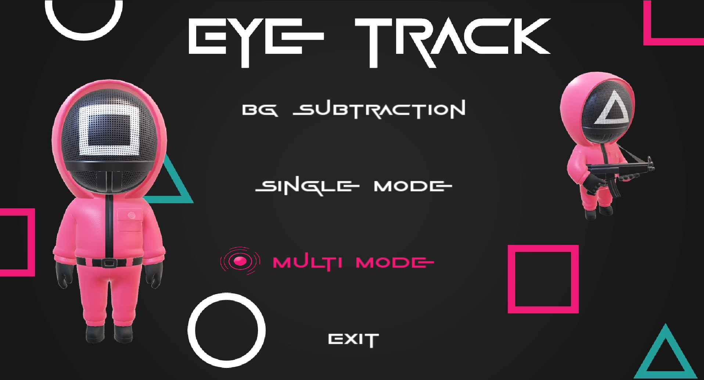

# Eye Track - Computer Vision 24


## Inhaltsverzeichnis

- [Eye Track - Computer Vision 24](#eye-track---computer-vision-24)
  - [Inhaltsverzeichnis](#inhaltsverzeichnis)
  - [Über das Projekt](#über-das-projekt)
    - [Features:](#features)
  - [Startmenü](#startmenü)
  - [Funktionen](#funktionen)
  - [Installation](#installation)
    - [Voraussetzungen](#voraussetzungen)
    - [Installationsschritte](#installationsschritte)
  - [Benutzung](#benutzung)
    - [Hintergrundsubtraktion](#hintergrundsubtraktion)
    - [Tracking-Modi](#tracking-modi)
    - [Ball-Spiel](#ball-spiel)
  - [Projektstruktur](#projektstruktur)
  - [Lizenz](#lizenz)

## Über das Projekt

Das Projekt **Eye Track** basiert auf Computer-Vision-Technologien und wurde entwickelt, um mehrere Tracking-Methoden und ein interaktives Spiel zu kombinieren. Es umfasst verschiedene Modi für die Analyse und Verarbeitung von Videos sowie ein Ball-Spiel mit Tracking-Funktionen.

### Features:
- Hintergrundsubtraktion (Background Subtraction)
- Einzel- und Mehrfachmodus für das Tracking
- Integration eines Spiels, das auf Tracking-Techniken basiert

Das Ziel dieses Projekts ist es, moderne Tracking-Algorithmen zu testen und sie in spielerischen Anwendungen zu verwenden.

## Startmenü

Das Startmenü bietet folgende Optionen:

- **BG Subtraction**: Führt eine Hintergrundsubtraktion durch.
- **Single Mode**: Aktiviert den Einzelmodus für das Tracking.
- **Multi Mode**: Aktiviert den Mehrfachmodus für das Tracking.
- **Exit**: Beendet die Anwendung.

Das Startmenü sieht wie folgt aus:



## Funktionen

- **Tracking-Modi**: Verfolgen Sie Objekte entweder im Einzel- oder Mehrfachmodus.
- **Spielmodi**: Nutzen Sie Tracking-Mechanismen, um ein interaktives Ball-Spiel zu spielen.
- **Auswertung**: Implementierung von Metriken wie IoU (Intersection over Union), MOTA (Multiple Object Tracking Accuracy), und mAP (Mean Average Precision).
- **Hintergrundsubtraktion**: Verarbeitung von Videoinhalten durch Entfernung des Hintergrunds.

## Installation

### Voraussetzungen

- Betriebssystem: Windows/Linux/MacOS
- **C++ Compiler** (z. B. GCC oder MSVC)
- **CMake** für die Projektkonfiguration
- Abhängigkeiten: OpenCV, TinyXML2

### Installationsschritte

1. Klonen Sie das Repository:

   ```bash
   git clone https://github.com/weski17/computer-Vision24.git
   cd computer-Vision24
   ```

2. Erstellen Sie ein Build-Verzeichnis und konfigurieren Sie das Projekt:

   ```bash
   mkdir build
   cd build
   cmake ..
   ```

3. Kompilieren Sie das Projekt:

   ```bash
   make
   ```

4. Starten Sie die Anwendung:

   ```bash
   ./EyeTrack
   ```

## Benutzung

### Hintergrundsubtraktion

1. Wählen Sie die Option "BG Subtraction" im Startmenü.
2. Laden Sie ein Video und starten Sie die Analyse.
3. Visualisieren Sie das Ergebnis der Subtraktion.

### Tracking-Modi

- **Single Mode**: Verfolgt ein einzelnes Objekt.
- **Multi Mode**: Verfolgt mehrere Objekte simultan.

### Ball-Spiel

- Der Tracking-Modus wird verwendet, um die Bewegung des Balls im Spiel zu steuern.

## Projektstruktur

- **src/**: Enthält den Quellcode des Projekts.
- **include/**: Beinhaltet die Header-Dateien.
- **rsrc/**: Ressourcen wie Bilder, Videos und XML-Daten.
- **data/**: Ausgabe und Zwischenspeicher.
- **CMakeLists.txt**: Build-Konfigurationsdatei.

## Lizenz

Dieses Projekt steht unter der [MIT-Lizenz](LICENSE).
